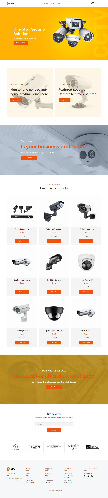
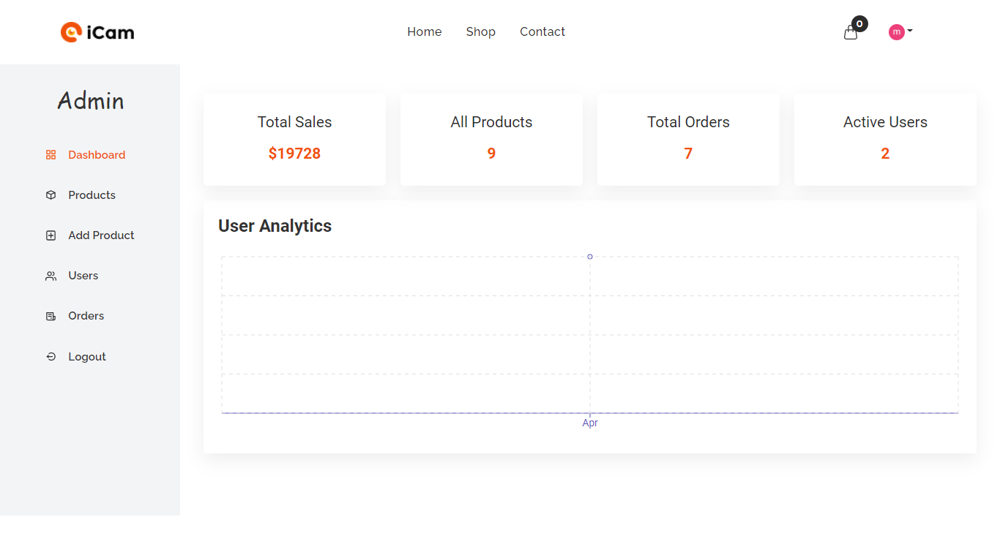

# Mern-camera-website using React + Redux + Sass + Node js + express js + Mongodb, Stripe payment gateway etc.

- Register, login with validation form and logout.
- Quick login with Google
- For authentication used google OAuth
- Forgot password, reset password and register a new account by Email verification.
- Update user information (name, password and avatar)
- Shopping cart functionality
- Implemented stripe payment gateway
- Implemented user dashboard where user see her profile and he see her orders and what is the stats of the individual orders
- Restful apis
- Impelemeted JSON web token for website security and also use refresh token for more secure
- Implemented Admin panel where admin manage all orders, update orders, remove orders, manage all users, update user role, upadate user, add new product, update product, remove product etc
- Admin panel have user User Analytics, sales status etc
- Responsive for all devices like mobile, tablet, laptop, desktop etc
- Used tecnologies:
- Fronted: React js, Reudx, Sass, React-bootstrap, React-router-dom, Framer-motion etc
- Backend: Node js, Express js, Mongodb, JSON web token, cloudinary etc

# Here is the Demo - (https://mern-camera-shop.herokuapp.com/)

# Website Interface -

# Admin Dashboard interface -

# User Dashboard interface -

